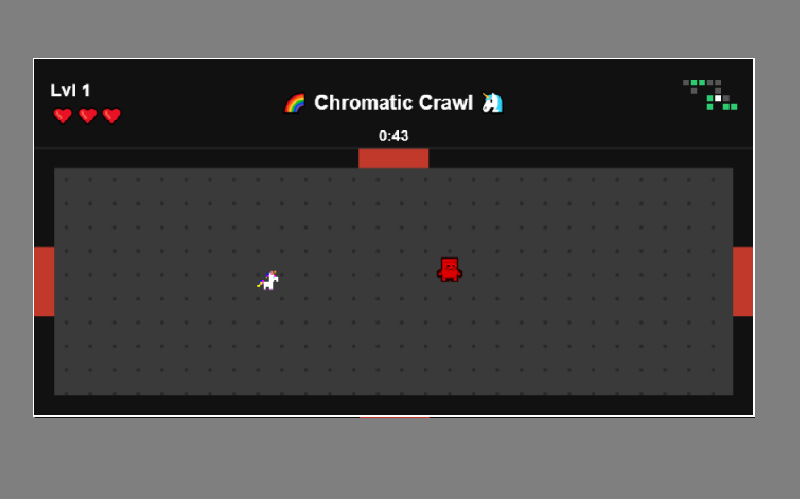

# Chromatic Crawl

## Description

The Moon Folk struck during the last eclipse, stealing every pot of gold from the Leprechaun's hoard. Without them, the rainbow has faded, and the world has drained to shades of gray.

You are a unicorn, and you must descend into the Moon Folk's dungeon to reclaim what was stolen.

Explore room by room. Each pot of gold you recover restores a color to the world — and each color grants your unicorn a new power, letting you overcome obstacles and guardians that stood in your way before.

Restore every color, rebuild the rainbow, and bring the world back to life.

## How to Play

1. Use the keyboard arrows to move your unicorn through the dungeon.
2. [ability/interact key — TBD]

## Difficulty Levels

* Only one level of difficulty.

Clear every room, recover every pot of gold, and see the rainbow restored!

